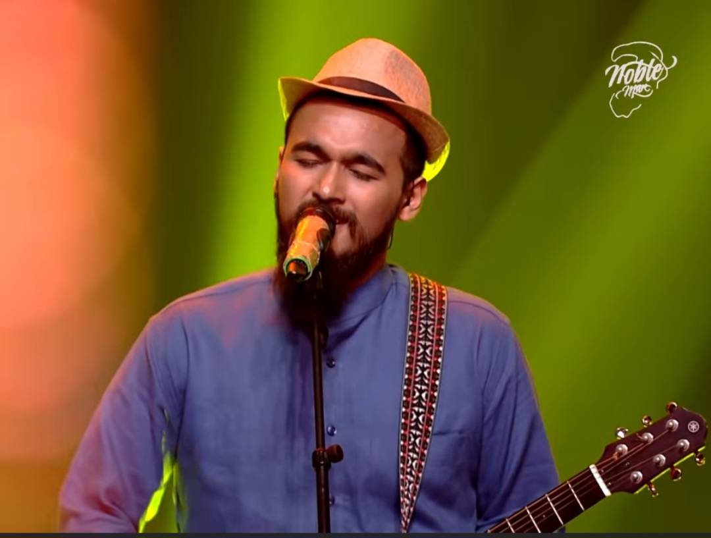

# NobleManAsciiArt

This project generates ASCII art of the famous Bangladeshi singer Mainul Ahsan Noble.

## Description

NobleManAsciiArt is a simple project that converts a photograph of Mainul Ahsan Noble into ASCII art. The ASCII representation is displayed in an HTML file, creating a unique and artistic rendition of the singer's image using only text characters.

## Contents

- `index.html`: Contains the ASCII art representation of Mainul Ahsan Noble.
- `src_image.jpg`: The source photograph of Mainul Ahsan Noble used to generate the ASCII art.

## Source Image

## How it Works

The project uses an image-to-ASCII conversion technique to transform the source image (`src_image.jpg`) into a text-based representation. This ASCII art is then embedded in the `index.html` file, which can be viewed in any web browser.

## Viewing the ASCII Art

To view the ASCII art:

1. Clone or download this repository.
2. Open the `index.html` file in a web browser.

## About Mainul Ahsan Noble

## Disclaimer

Please note that the information provided about Mainul Ahsan Noble in this README is sourced from various online platforms and Google searches. While efforts have been made to ensure accuracy, we cannot guarantee the complete reliability or up-to-date nature of this information. Users are advised to verify any critical details from official sources or more recent publications.

Mainul Ahsan Noble is a renowned Bangladeshi singer, songwriter, and composer. Born on October 31, 1995, in Barisal, Bangladesh, Noble rose to fame after participating in the reality TV show "Sa Re Ga Ma Pa" in 2018-2019, where he finished as the first runner-up.

Key facts about Mainul Ahsan Noble:

1. Early Life: Noble showed interest in music from a young age and started learning classical music at the age of 8.

2. Education: He completed his Higher Secondary Certificate (HSC) from Barisal Government College.

3. Musical Journey: Noble's journey in the music industry began with local performances and gradually expanded to national platforms.

4. Sa Re Ga Ma Pa: His participation in the popular Indian reality show "Sa Re Ga Ma Pa" in 2018-2019 brought him widespread recognition.

5. Notable Works: Some of his popular songs include "Bushra," "Bhul Korechi," and "Amar Poran."

6. Style: Noble is known for his soulful voice and his ability to blend classical elements with modern music.

7. Awards: He has received several awards for his contributions to music, including the "Best Male Singer" award at the Meril Prothom Alo Awards in 2020.

8. Social Media Presence: Noble is active on various social media platforms, where he shares his music and interacts with fans.

This project aims to pay tribute to Noble's artistry in a unique, digital format, celebrating his contributions to the Bangladeshi music industry.

## Contributing

Contributions to improve the ASCII art generation or expand the project are welcome. Please feel free to fork the repository and submit pull requests.

## License

This project is free software: you can redistribute it and/or modify it under the terms of the GNU General Public License as published by the Free Software Foundation, either version 3 of the License, or (at your option) any later version.

This project is distributed in the hope that it will be useful, but WITHOUT ANY WARRANTY; without even the implied warranty of MERCHANTABILITY or FITNESS FOR A PARTICULAR PURPOSE. See the GNU General Public License for more details.

You should have received a copy of the GNU General Public License along with this program. If not, see <https://www.gnu.org/licenses/>.
